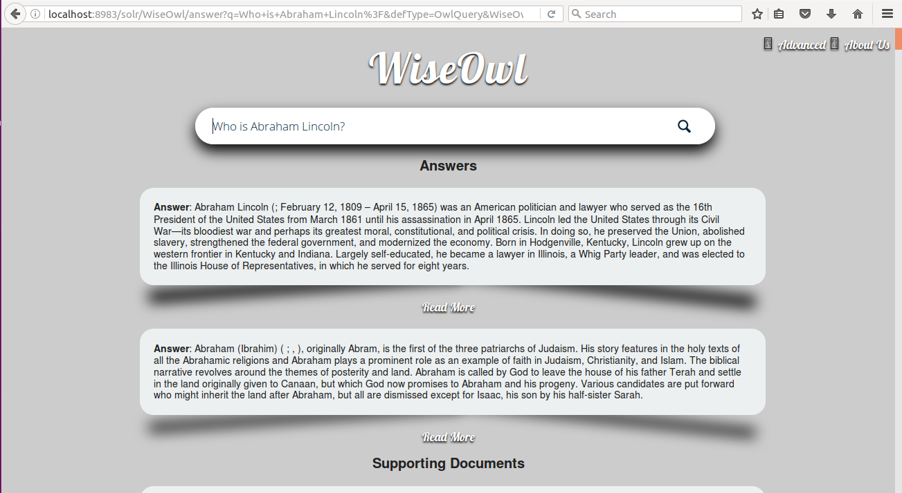
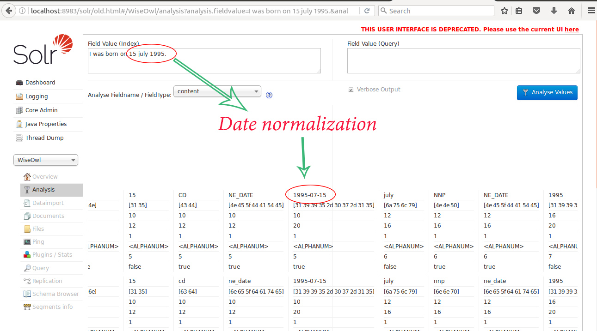
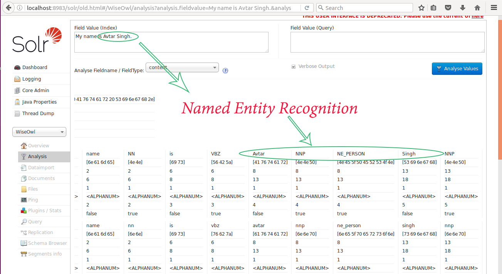

# WiseOwl 
_This is a Fact based Question Answering System using Apache Solr as backend search engine, Wikipedia dumps as information source, Apache velocity , Html, Css for Web interface Design. The project also uses Linux bash script to perform its various functions like start,stop,training and indexing_

## Features:
* Fast and reliable searching using open source Apache Solr 6.3.0 and Apache Lucene 6.3.0 projects. Apache Solr is used as a search engine which uses capabilities of Apache Lucene to profide searching.
* Custom-made Query Parser based on Apache Lucene 6.3.0 specially optimized for Question Answering.
* Named Entity Recognition and Time normalization during indexing using StanfordCoreNLP.
* Automatic cleaning and parsing of Wikipedia Raw text from the wikipedia dumps. It is achieved by using Lucene 6.3 benchmark classes and WikiClean Project.
* Answer Type Classification of given question using Apache OpenNLP's Maxent Models, Models are trained on data taken from thesis by Tom Morton, tagging aroung 1800 handnpicked questions. 
* Currently the project is more optimised for Description Type Answers.
* Sleek user interface by combining elements of css, html and Apache Velocity.
* Bash script which uses underlying solr scripts to provide functionality of starting, stoping, indexing and training.

## Installation 
Throughout this document, WiseOwl_HOME is the base directory for all the wiseowl code
### Required Downloads 
-----------------------------------------------------------------------------------------------------------------------
Throughout this document, WiseOwl_HOME is the base directory for all the wiseowl code

WiseOwl uses Maven for building and running the code.  To get
started, you will need:

1. JDK 1.7+ 
2. Maven 3.0 or higher installed
3. The OpenNLP English models, available at 
   http://opennlp.sourceforge.net/models-1.5/
   
   Download all the models, and place the in WiseOwl_HOME/opennlp-models
   place ans.bin model from the repository to WiseOwl_HOME/opennlp-models/qa
   

4. Get WordNet 3.0 and place it in the WiseOwl_HOME root directory.
   (usually it comes as zipped file, so unzip it using gunzip or other utilities)
   You may find it at the given link or perform a simple google search to find it.
   http://wordnetcode.princeton.edu/3.0/WordNet-3.0.tar.gz
   
5. Download Apache Solr 6.3.0 available at
   http://lucene.apache.org/solr/
   copy contrib, server and dist folder from Solr 6.3.0 package to WiseOwl_HOME root directory

## Building the Source
----------------------------------------------

Prior to building the source, for those previously unfamiliar with Maven,
it may be wise to read this to avoid future hassles:
http://maven.apache.org/guides/getting-started/maven-in-five-minutes.html

To build the source, in WiseOwl_HOME:

   mvn clean package 

## Running the System
--------------------
1. Goto the WiseOwl_HOME/bin directory and open a terminal there.
  type : 
 * ./WiseOwl        : For different options available 
 * ./WiseOwl start  : To start the Apache Solr Server
 * ./WiseOwl stop   : To stop the server
2. Point your web browser to 
   http://localhost:8983/solr/WiseOwl/answer
   
   You will see a screen similar to a screen below.
 

## Speacial Thanks:

We are greatly thankful to Grant Ingersoll for their open source project under the book TamingText
Their work is really great! We have built on their code. We thank them so much. It was great help and learning experience for us.
Their original project can be found at:
https://github.com/tamingtext/book 
